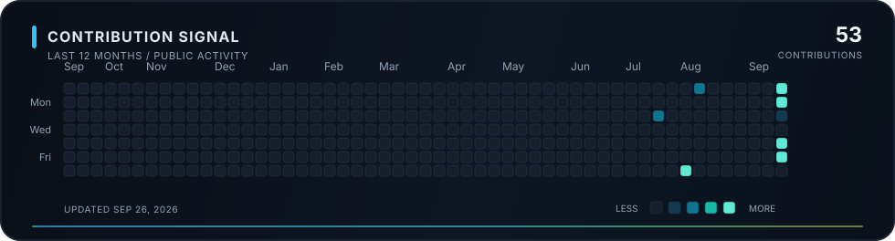

 

  

 

## About

I am a Computer Science undergraduate at the **Bangladesh University of Engineering and Technology (BUET)**. I enjoy turning difficult problems into useful software—from dependable APIs and optimization models to interactive applications.

My projects span backend systems, applied AI, academic implementations, and competition builds. I care about clear design, meaningful tests, and software that remains understandable after it ships.

### Current Focus

- Building reliable backend systems and well-defined APIs
- Exploring practical AI with deterministic validation
- Applying algorithms and optimization to real-world problems

## Technical Toolkit

### Programming Languages

### Tools & Infrastructure

Software Engineering · Backend Systems · Applied AI · Algorithms · Optimization · REST APIs

 

## Featured Work

01 / BUP CSE FEST 2026 / HACKATHON

### AI-Assisted Energy Optimization System

An optimization API that turns natural-language operator instructions into structured directives, validates them through deterministic guardrails, applies them as constraints to a linear-programming model, and independently checks the generated energy schedule.

`LLM integration` `Linear programming` `REST API` `Docker` `Automated testing`

 

02 / NASA SPACE APPS CHALLENGE 2026 / IN PROGRESS

### Junior Astronaut Mission Trainer

An educational simulation built around managing a lunar or Martian outpost. It makes engineering trade-offs understandable through decisions involving power, life support, food production, and radiation protection.

`Simulation` `Systems design` `Education` `Space technology`

 

03 / BUET / UNDERGRADUATE REPOSITORY

### ACADEMICS

A growing archive of coursework, assignments, laboratory work, and implementations from my undergraduate CSE journey—from programming fundamentals to core computer science subjects.

[View repository](https://github.com/shanto0202/ACADEMICS)

 

04 / PERSONAL PROJECT / SECURE DOCUMENT DELIVERY

### pdfshelf

A mobile-friendly PDF distribution system with administrator-managed accounts, single-session authentication, account-specific watermarking, and an in-browser reader.

[View repository](https://github.com/shanto0202/pdfshelf)

 

05 / IUT 12TH ICT FEST 2026 / 48-HOUR GAME JAM

### Kickoff — 2D Football Game

A team-built 2D football game developed under a fixed competition deadline around the theme “Kickoff” and recognized with a **Rising Star** award.

[View team repository](https://github.com/Atul-169/GameJam-KickOff)

 

## GitHub Activity

  

 

Contribution data updates automatically from public GitHub activity.

## Connect

I am open to conversations about software engineering, project ideas, competitions, and collaborative builds.

 

  

