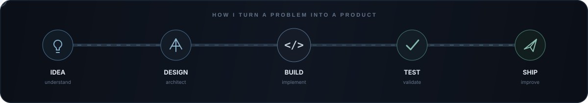

<!-- Minimal profile README. Custom SVG animations are stored in ./assets. -->

<div align="center">



<br />

<a href="https://github.com/shanto0202"></a>
<a href="https://www.linkedin.com/in/shahariar-rahman-shanto/"></a>
<a href="https://leetcode.com/u/shanto0202/"></a>

<br /><br />

<a href="#about">About</a> &nbsp;·&nbsp;
<a href="#toolkit">Toolkit</a> &nbsp;·&nbsp;
<a href="#featured-work">Work</a> &nbsp;·&nbsp;
<a href="#github-activity">Activity</a> &nbsp;·&nbsp;
<a href="#connect">Connect</a>

<br /><br />


</div>


## About

```yaml
name: Shahariar Rahman Shanto
education: "Computer Science & Engineering @ BUET"
location: Bangladesh
focus: [Software Engineering, Applied AI, Backend Systems, Algorithms]
approach: "Understand the problem. Build carefully. Improve continuously."
```

I am a Computer Science undergraduate at the **Bangladesh University of Engineering and Technology (BUET)**. I enjoy working where careful problem-solving meets practical engineering—designing dependable APIs, modeling optimization problems, and turning technical ideas into useful software.

My experience includes backend systems, applied AI, academic implementations, optimization, interactive applications, and time-constrained competition projects. I care about clear abstractions, deliberate validation, meaningful tests, and software that remains understandable after it ships.

### Current direction

- Strengthening core computer science and software engineering fundamentals
- Building reliable backend systems and well-defined APIs
- Exploring practical AI integrations with deterministic guardrails
- Applying algorithms and optimization to real-world problems

## Toolkit

<div align="center">

### Languages


### Development


<sub>Software Engineering · Backend Systems · Applied AI · Algorithms · Optimization · REST APIs</sub>

</div>


## Featured Work

### AI-Assisted Energy Optimization System

<sub>BUP CSE Fest 2026 · Hackathon</sub>

An optimization API that turns natural-language operator instructions into structured directives, validates them through deterministic guardrails, applies them as constraints to a linear-programming model, and independently checks the generated energy schedule.

`LLM integration` `Linear programming` `REST API` `Docker` `Automated testing`

<br />

### Junior Astronaut Mission Trainer

<sub>NASA Space Apps Challenge 2026 · In progress</sub>

An educational simulation built around managing a lunar or Martian outpost. It makes engineering trade-offs understandable through decisions involving power, life support, food production, and radiation protection.

`Simulation` `Systems design` `Education` `Space technology`

<br />

### ACADEMICS

<sub>BUET undergraduate repository</sub>

A growing archive of coursework, assignments, laboratory work, and implementations from my undergraduate CSE journey—from programming fundamentals to core computer science subjects.

[View repository](https://github.com/shanto0202/ACADEMICS)

<br />

### pdfshelf

<sub>Secure document delivery · Personal project</sub>

A mobile-friendly PDF distribution system with administrator-managed accounts, single-session authentication, account-specific watermarking, and an in-browser reader.

[View repository](https://github.com/shanto0202/pdfshelf)

<br />

### Kickoff — 2D Football Game

<sub>IUT 12th ICT Fest 2026 · 48-hour game jam · Rising Star award</sub>

A team-built 2D football game developed under a fixed competition deadline around the theme “Kickoff.”

[View team repository](https://github.com/Atul-169/GameJam-KickOff)

<br />



## GitHub Activity

<div align="center">

<a href="https://github.com/shanto0202?tab=overview"></a>

<br />

<sub>Updated automatically from public GitHub activity.</sub>

</div>

## Working Principles

- **Understand before implementing.** A clear problem statement prevents unnecessary complexity.
- **Design useful boundaries.** Validation and predictable interfaces belong in the architecture.
- **Prefer evidence over assumption.** Tests, measurements, and small experiments guide decisions.
- **Write for the next developer.** Readability and documentation are part of the product.
- **Keep learning.** Every project should expand the engineering toolbox.

## Connect

<div align="center">

I am open to conversations about software engineering, project ideas, competitions, and collaborative builds.

<br />

<a href="https://github.com/shanto0202"></a>
<a href="https://www.linkedin.com/in/shahariar-rahman-shanto/"></a>
<a href="https://leetcode.com/u/shanto0202/"></a>

<br /><br />

`while (curious) { learn(); build(); improve(); }`

<br />

<sub>Building continuously. Learning deliberately.</sub>

</div>
